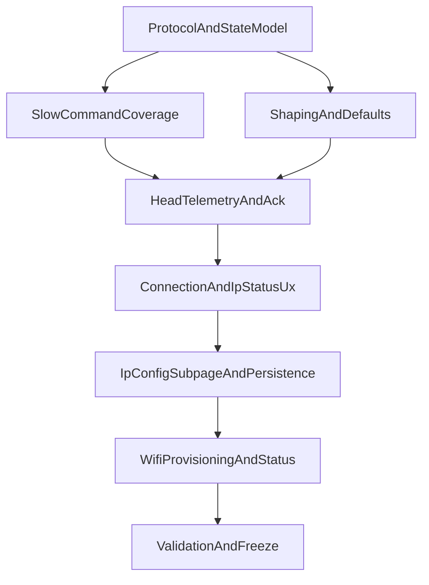

# BGC Controls and Telemetry Expansion Plan

## Goals and Constraints

- Keep current appliance boot/service baseline stable (`mvp-lite-devzone`), and layer functionality incrementally.
- Prioritize protocol/data-model work before UI polish.
- Preserve backward compatibility where possible with existing `mvp_ui_3` and bridges.

## Execution Status Snapshot (last 14h)

- Completed and validated on `mvp-lite-devzone`:
  - Fast/slow head selection consistency (`e94e923`).
  - Full slow-command/state expansion and UI state model baseline (`7945316`).
  - On-screen keyboard shift/caps and IP draft persistence fixes (`b559ef1`).
  - Input calibration workflow (UI request -> ADC sampling -> center offset persist) (`3350c69`, `de36339`).
  - Deadband controls exposed in shaping and applied to ADC profile (`b34ab2a`).
  - Input Tests diagnostics tab with measurable filter counters and encoder test values (`f212b10`, `c8c710d`, `a640a00`, `a1982a1`, `1e96271`).
  - ENC4 CW/CCW correction (`9b1c7be`).
  - UI scaling rule document and defaults/non-wrap behavior (`01306bd`, `30d91b7`).
  - Full normalized-stepping attempt was reverted due to kiosk regression (`c56a678` -> `f74b4ae`).
  - Fuji zoom telemetry stabilized with safe polling, now 3 Hz (`ca7e7b0`, `03b7a93`) after reverting risky variant (`703f7e7`).
  - Analog shaping controls normalized to UI `0..10` with legacy migration mapping (`2c950b6`).

- Appliance resilience work completed after recovery:
  - Crash-safe boot hardening: atomic cmdline write, LKG backup, install guard, boot self-heal service, persistent journald (`0e7fc91`).

- Current priority now:
  - Burn-in validation for no-UPS behavior and finalize freeze docs/checklists with hardened boot policy.

## Current Architecture Findings

- Slow command pipeline exists (`mvp_ui_3` -> `mvp_slow_bridge.py` -> UDP slow cmd packet via `mvp_protocol.py`), but only a small key subset is actively surfaced.
- Fast shaping controls (speed/invert/expo machinery) are split and not exposed via the `mvp_ui_3` websocket contract.
- ACK/telemetry packet structures exist in protocol helpers but are not wired end-to-end.
- Connection status in UI currently reflects WS connection only, not physical/network/head reachability.

## Sub-Projects (Prioritized)

### 1) Protocol and State Model Foundation (highest priority)

- Expand a single canonical state schema for:
  - Slow command desired state
  - Head-reported applied state
  - Input shaping profile state (expo/top speed/invert)
  - Connection/IP status state
- Normalize message contracts between UI and bridge (`STATE`, `SET_*`, `*_APPLIED`, `STATUS`).
- Add explicit versioning field in state payloads to support iterative expansion.
- Primary files:
  - `apps/controller/mvp_protocol.py`
  - `apps/controller/mvp_slow_bridge.py`

### 2) Slow Command Coverage Expansion

- Extend bridge/UI handling beyond current minimal keys to full BGC slow set already defined in protocol.
- Add per-key apply feedback path (`pending`, `sent`, `confirmed` when telemetry/ack is available).
- Ensure selected-head persistence remains compatible.
- Primary files:
  - `apps/controller/mvp_slow_bridge.py`
  - `apps/controller/mvp_ui_3_layout.js`
  - `apps/controller/mvp_ui_3.html`

### 3) Analog Input Shaping + Defaults System (core architecture change)

- Expose shaping controls (expo, top speed, invert) via websocket/API contract.
- Introduce dual-layer defaults:
  - Factory defaults (repo-shipped immutable baseline)
  - User defaults (runtime mutable, persisted)
- Add profile load/save/reset operations and deterministic startup precedence.
- Persist user defaults through power cycles.
- Primary files:
  - `apps/controller/mvp_bridge_adc_state.py`
  - `apps/controller/mvp_bridge_adc_shape.py`
  - `apps/controller/mvp_slow_bridge.py`
  - `apps/controller/mvp_ui_3.html`

### 4) Head Telemetry and Feedback Channel (core architecture change)

- Wire runtime receiver/sender for slow ACK and telemetry paths currently only represented in protocol helpers.
- Add periodic telemetry ingestion for:
  - Current applied slow-command states
  - Lens id / zoom position / focus position
  - BGC diagnostics (including power levels)
- Merge telemetry into bridge-published UI state model.
- Primary files:
  - `apps/controller/mvp_protocol.py`
  - `apps/controller/mvp_slow_bridge.py`
  - `apps/head_eng/main.py`

### 5) Connection and Network Status UX

- Add explicit status layers:
  - Physical layer link state (LAN up/down)
  - Head connectivity state (`connected` / `trying` / `disconnected`)
  - Bridge health state
- Publish and display:
  - Pi LAN IP/gateway/subnet info
  - Selected head IP/port info and live reachability state
- Primary files:
  - `apps/controller/mvp_slow_bridge.py`
  - `apps/controller/mvp_ui_3.html`
  - `Pi5 Setup/scripts/hydravision-validate.sh`

### 6) IP Config Subpage + Persistent Network Profiles (core architecture change)

- Add a dedicated UI subpage (`IP Config`) with:
  - On-screen keyboard for text/numeric entry
  - Editable fields for Pi LAN: address, subnet, gateway
  - Editable fields for up to 15 heads: address, subnet, gateway (or equivalent per-head network tuple)
- Add profile persistence model that survives power cycles:
  - Factory defaults (immutable baseline)
  - User overrides (persistent runtime state)
- Add a `Factory Default` action that resets:
  - Pi LAN config to default
  - Head #1 config to default
  - Leaves other head user entries unchanged unless explicitly reset
- Add apply/validate workflow:
  - Input validation before commit
  - Pending/apply/error feedback in UI
  - Controlled handoff to network apply script/service
- Primary files:
  - `apps/controller/mvp_ui_3.html`
  - `apps/controller/mvp_ui_3_layout.js`
  - `apps/controller/mvp_slow_bridge.py`
  - `Pi5 Setup/scripts/hydravision-configure-ethernet.sh`
  - `apps/controller/heads.json`

### 7) Wi-Fi Provisioning + SSH Connectivity UX (core architecture change)

- Add a Wi-Fi panel/page (standalone or under `IP Config`) with:
  - Scan and list available SSIDs
  - Select SSID and enter password using on-screen keyboard
  - Connect/disconnect actions and current active network display
- Add bridge/API contract for Wi-Fi operations:
  - `WIFI_SCAN`
  - `WIFI_CONNECT {ssid,password}`
  - `WIFI_DISCONNECT`
  - `WIFI_STATUS`
- Apply changes through NetworkManager (`nmcli`) so credentials and connection persist across reboot.
- Add SSH-friendly status outputs:
  - current WLAN IP
  - connect/auth failure state and retry state
  - LAN and Wi-Fi status shown together to avoid lockout ambiguity
- Primary files:
  - `apps/controller/mvp_ui_3.html`
  - `apps/controller/mvp_ui_3_layout.js`
  - `apps/controller/mvp_slow_bridge.py`
  - `Pi5 Setup/bookworm-lite-appliance/install.sh`

### 8) Validation, Burn-in, and Freeze Update

- Extend validation scripts/checklists for new telemetry/status/profile persistence guarantees.
- Add explicit reboot persistence tests for user defaults.
- Add explicit persistence/apply tests for the `IP Config` subpage and factory reset behavior.
- Add Wi-Fi provisioning and SSH reconnection persistence tests.
- Freeze and document message contracts + operational acceptance checks before UI polish phase.
- Primary docs:
  - `Pi5 Setup/VALIDATION_RUNBOOK.md`
  - `Pi5 Setup/FastCleanBootDevelopment.md`

## Dependency Order

## Implementation Strategy

- Phase A: Define/lock message schema and persistence model first.
- Phase B: Implement backend bridge behavior and telemetry plumbing with minimal UI changes.
- Phase C: Add UI controls/views for new data, keep visuals utilitarian until function is proven.
- Phase D: Run persistence + power-cycle + network-failure tests, then freeze.

## Risks and Mitigations

- Contract drift between UI and bridge:
  - Mitigation: schema version + strict message validators.
- Regressing currently stable boot/control path:
  - Mitigation: keep service wiring unchanged; isolate feature changes to bridge/UI layers first.
- Telemetry partial availability from head firmware:
  - Mitigation: status fields support `unknown`/`stale` states and degrade gracefully.
- Default profile confusion:
  - Mitigation: explicit `factory` vs `user` namespaces and reset action semantics.
