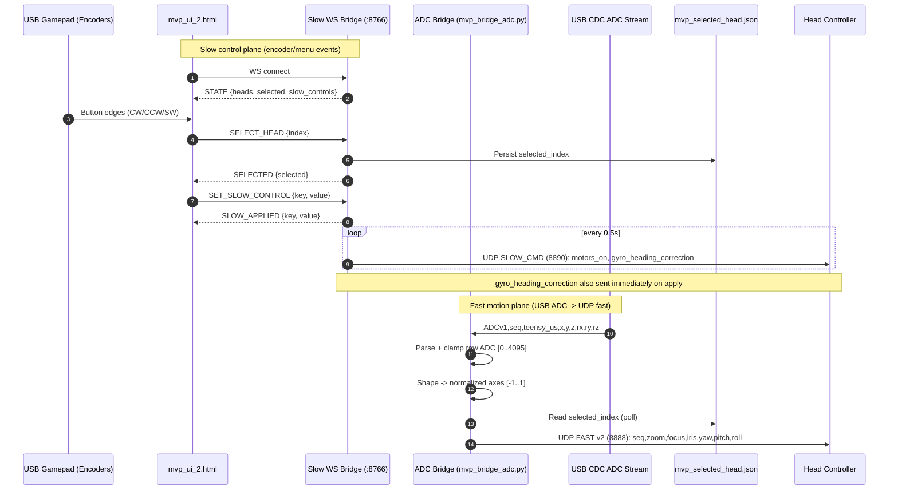

# Controller End - One-Page Sequence Diagram

## Runtime Sequence (Slow + Fast Split)

## Message/API Snapshot

- Slow WS API (`:8766`)
  - Client -> server: `SELECT_HEAD`, `SET_SLOW_CONTROL`
  - Server -> client: `STATE`, `SELECTED`, `SLOW_APPLIED`
- Slow UDP API (`8890`)
  - Packet type: `PKT_SLOW_CMD (0x20)`
  - Active keys in current slow bridge loop: `motors_on`, `gyro_heading_correction`
- Fast UDP API (`8888`)
  - Packet format: v2 fast packet `<BBBHhHHHHHH>`
  - Carries axis/motion controls continuously at configured rate (default ~50 Hz)

## Key Integration Point

- `mvp_selected_head.json` is the shared contract between planes:
  - Slow bridge writes selected head index.
  - ADC fast bridge follows that index for retargeting fast UDP output.
