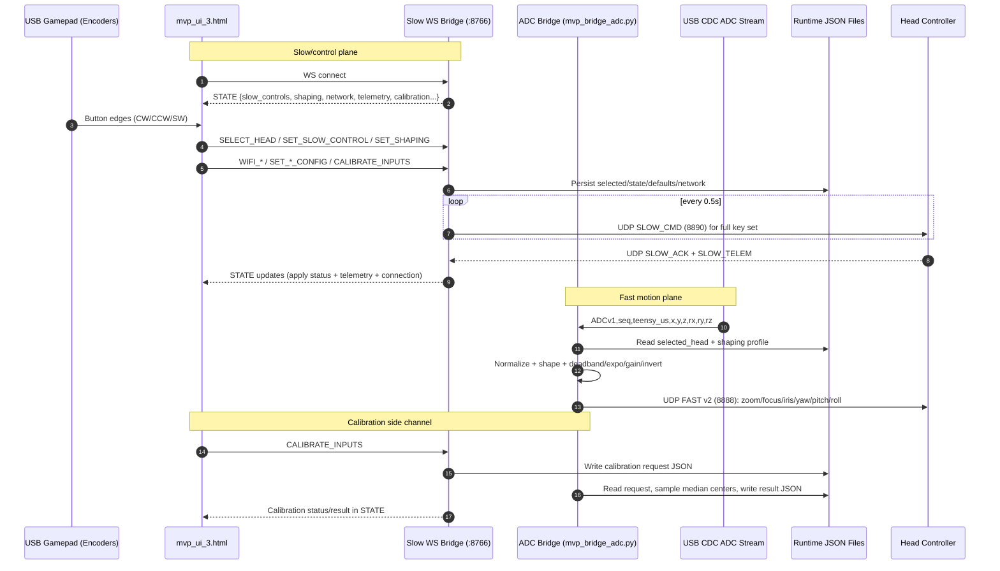

# Controller End - One-Page Sequence Diagram

## Runtime Sequence (Current `mvp_ui_3` stack)

## Message/API Snapshot

- Slow WS API (`:8766`)
  - Client -> server:
    - `REQUEST_STATE`, `SELECT_HEAD`, `SET_SLOW_CONTROL`
    - `SET_SHAPING`, `SAVE_USER_DEFAULTS`, `RESET_USER_DEFAULTS`
    - `SET_PI_LAN_CONFIG`, `SET_HEAD_CONFIG`, `APPLY_NETWORK_CONFIG`, `FACTORY_RESET_NETWORK`
    - `WIFI_SCAN`, `WIFI_CONNECT`, `WIFI_DISCONNECT`, `WIFI_STATUS`
    - `CALIBRATE_INPUTS`
  - Server -> client:
    - `STATE`
    - result envelopes (`*_RESULT`, `*_SAVED`, `SHAPING_APPLIED`, `CALIBRATE_INPUTS_ACCEPTED`)
- Slow UDP API (`8890`)
  - Packet type: `PKT_SLOW_CMD (0x20)` + ACK/telemetry ingest path.
- Fast UDP API (`8888`)
  - Packet format: v2 fast packet `<BBBHhHHHHHH>` at configured stream rate.

## Key Integration Point

- `heads.json` + `mvp_selected_head.json` remain the shared targeting contract:
  - slow bridge owns selection persistence,
  - ADC fast bridge follows same selection for fast-path routing.
