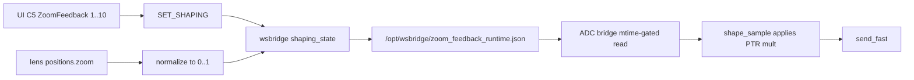

# Zoom Dampening Feedback

## Sit rep and next actions

### What’s implemented

- Zoom Feedback control 1..10 in UI (C5 slot); shaping schema and SET_SHAPING; zoom position normalized 0..1 in wsbridge; runtime JSON written to `/opt/wsbridge/zoom_feedback_runtime.json`; ADC bridge reads file (mtime-gated) and applies log-scale PTR multiplier to X/Y/Z only; Top Speed remains overall clamp, damping scales within it.

### Current status

- On Pi: Pan at BGC not observed to change when changing Zoom Feedback or zoom position. Wsbridge was running an old copy from `/opt/wsbridge` (no runtime file); after copying updated `mvp_slow_bridge.py` into `/opt/wsbridge`, the runtime file appears. Controller runs from repo (`controller_daemon` invokes `mvp_bridge_adc.py` with `--profile-dir /opt/wsbridge`).

### Root-cause options (code-path only)

- **Path:** Damping runs only if `zoom_feedback_data` is set. That happens only when `_load_zoom_feedback_runtime_mtime_gated` returns a dict. It returns data only when the file exists at the path used. Path is `/opt/wsbridge/zoom_feedback_runtime.json` if and only if `os.path.isdir("/opt/wsbridge")` is True when the controller starts; otherwise path is `runtime_dir + "/zoom_feedback_runtime.json"` (e.g. repo `apps/controller/`), where the file is not created.
- **Exception:** Any exception in the load (permission, JSON, I/O) is swallowed; then `zoom_feedback_data` stays None and damping is never applied.

### Next actions (before resuming this feature)

- On device: Confirm path in use via `journalctl -u controller.service -n 100 --no-pager | grep "Zoom feedback runtime path"`; confirm file exists at that path (e.g. `test -f /opt/wsbridge/zoom_feedback_runtime.json`).
- Optional: Log or re-raise in the `except Exception` block in `_load_zoom_feedback_runtime_mtime_gated` ([mvp_bridge_adc.py](mvp_bridge_adc.py) ~line 124) to surface load failures.
- Optional: Manual test with `zoom_feedback: 10`, `zoom_norm: 1.0` in the runtime file and controller restart to confirm BGC Pan drops when damping is active.

---

## Requirements

- User sets **Zoom Feedback** (1..10) from UI; value persists with shaping defaults.
- At **full zoom**, PTR max speed is limited by the Zoom Feedback factor (e.g. feedback 10 → max PTR ~1/10 of Top Speed cap).
- **Log-scale** damping: as zoom position increases from wide to tele, PTR speed is progressively reduced (smooth curve, not step).
- **Top Speed** per axis remains the overall clamp; damping is a multiplier applied within that clamp.
- **Zoom axis (Zrotate)** is unchanged by this feature.
- Fast path remains stable (no blocking I/O in hot loop; mtime-gated read).

---

## Solution architecture

### Data flow

- UI C5 Zoom Feedback 1..10 → SET_SHAPING → wsbridge `shaping_state.zoom_feedback`.
- Lens telemetry `positions.zoom` → wsbridge normalizes to 0..1 (`zoom_norm`), tracks min/max, exposes in STATE.
- Wsbridge writes runtime handoff: `/opt/wsbridge/zoom_feedback_runtime.json` with `zoom_feedback`, `zoom_norm`, `timestamp` (on state/telemetry publish cadence).
- ADC bridge (controller) reads that file (mtime-gated), passes dict into `shape_sample`; shaping layer applies PTR multiplier to X, Y, Z only; result sent via `send_fast`.

### Damping law

- `mult_end = 1.0 / zoom_feedback`
- `blend = log1p(k * zoom_norm) / log1p(k)` (k = 9)
- `mult = 1.0 - (1.0 - mult_end) * blend`
- Applied to X, Y, Z after existing gain/clamp.

### Key files

- [mvp_slow_bridge.py](mvp_slow_bridge.py): shaping schema `zoom_feedback`, zoom normalization, `_write_zoom_feedback_runtime()`, path `_zoom_feedback_runtime_path()`.
- [mvp_bridge_adc.py](mvp_bridge_adc.py): `_zoom_feedback_runtime_path(runtime_dir)`, mtime-gated load, pass into `shape_sample`.
- [mvp_bridge_adc_shape.py](mvp_bridge_adc_shape.py): `_ptr_damping_multiplier()`, apply mult to X/Y/Z in `shape_sample`.
- [mvp_ui_3_layout.js](mvp_ui_3_layout.js) / [mvp_ui_3.html](mvp_ui_3.html): C5P5 Zoom Feedback 1..10, `shape_zoom_feedback`, local auto-apply.

### Appliance note

- Wsbridge runs from `/opt/wsbridge/mvp_slow_bridge.py` (copied at install). Controller runs from repo with `--profile-dir /opt/wsbridge`. After UI or bridge changes, copy updated files into `/opt/wsbridge` and/or `/opt/ui` and restart services as needed.
