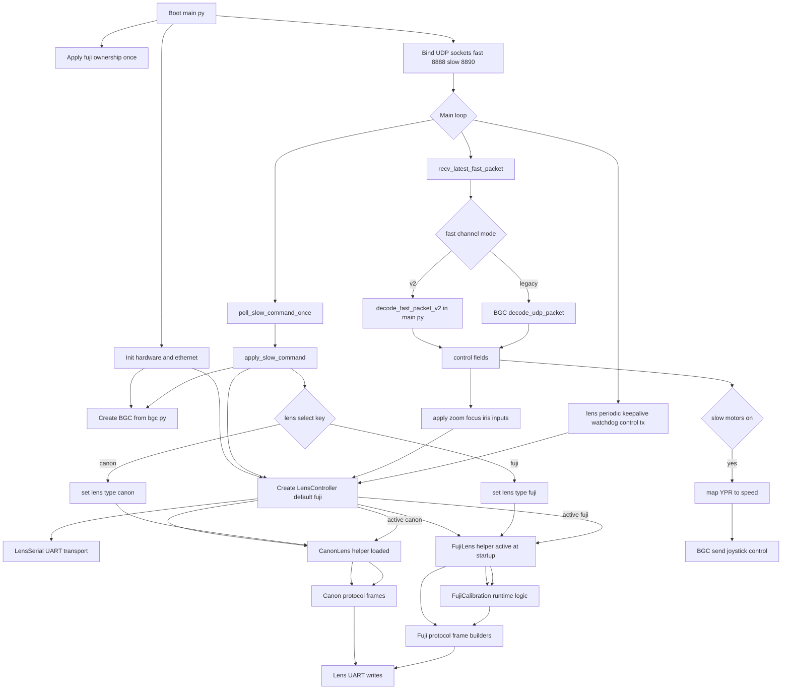

# Main Runtime Flow

This diagram shows the programs and helpers involved when `main.py` runs, including the Canon path when slow command `lens_select` switches to Canon.

Static image artifact: `main_runtime_flow.png`  
Mermaid source artifact: `main_runtime_flow.mmd`

